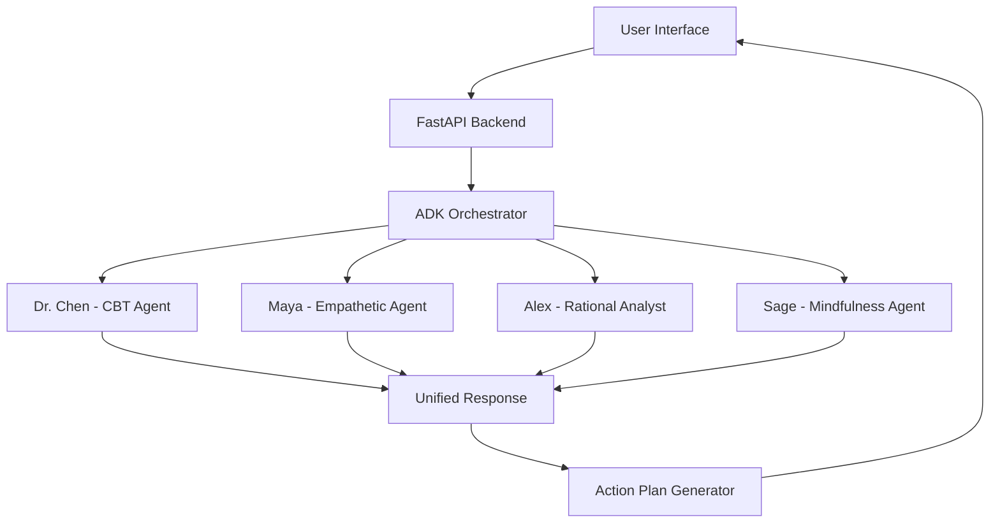

# PersonaReflect 🎭

## AI-Powered Multi-Agent Self-Reflection Coach

### 🏆 HackDuke 2025 Project

> **⚠️ Important:** This project is actively developed on the `backend_ai2` branch, which contains the latest features including voice input, emotion charts, and enhanced calendar integration. Please use `backend_ai2` as the default branch.

PersonaReflect uses Google ADK to create a multi-agent system that provides diverse perspectives on personal dilemmas through four distinct AI personas.

## 🌟 Features

* **4 Specialized AI Coaches**: Each with unique perspectives and approaches

  * 🧠 **Dr. Chen** — Cognitive-Behavioral Coach
  * 💙 **Maya** — Empathetic Friend
  * 📊 **Alex** — Rational Analyst
  * 🧘 **Sage** — Mindfulness Mentor
* **Multi-Agent Orchestration**: Using Google ADK for coordinated responses
* **Action Plan Generation**: Synthesizes insights into concrete steps
* **Beautiful React Frontend**: Clean, intuitive interface
* **Real-time Processing**: Fast, parallel agent responses

## 🚀 Quick Start (Hackathon Demo)

### Prerequisites

* Python 3.11+
* Node.js 18+
* Google API Key (for Gemini)

### Setup & Install

```bash
# Clone the repo and checkout the backend_ai2 branch
git clone https://github.com/yuancx2025/hackDuke2025
cd hackDuke2025
git checkout backend_ai2

# Install backend + frontend dependencies
make install

# Copy env template and add your Google API key
cp backend/.env.example backend/.env
# edit backend/.env and set GOOGLE_API_KEY=<your-key>
```

### Backend Smoke Test

```bash
cd backend
python quick_test.py
# ➡︎ optionally run the live agent test when prompted (requires valid Google AI key)
```

### Interactive Agent Demo

```bash
cd backend
python interactive_demo.py
```

### Run the Full Stack

```bash
# Backend only (FastAPI + hot reload)
make backend

# Frontend only (Vite dev server)
make frontend

# Both frontend & backend (parallel)
make dev

# Docker (full stack)
make docker-up
```

### Full-Stack Integration Test

**Two-terminal setup:**

```bash
# Terminal 1: Backend
cd backend
uvicorn persona_reflect.main:app --reload --host 0.0.0.0 --port 8000

# Terminal 2: Frontend  
cd frontend
npm run dev
```

Then open [http://localhost:5173](http://localhost:5173) and test the complete flow:

1. Check for "Connected to AI backend!" toast notification
2. Click "Start New Reflection"
3. Enter a dilemma and submit
4. Verify all 4 AI personas respond (10–20 seconds)
5. Create and save an action plan

---

## 🏗️ Architecture



## 📚 API Endpoints

| Endpoint             | Method | Description                                   |
| -------------------- | ------ | --------------------------------------------- |
| `/`                  | GET    | Health check                                  |
| `/api/reflect`       | POST   | Process dilemma through all personas          |
| `/api/action-plan`   | POST   | Generate action plan from insights            |
| `/api/personas`      | GET    | Get persona information                       |
| `/api/alex/schedule` | POST   | Get available time slots from Google Calendar |
| `/api/alex/book`     | POST   | Create a new event on Google Calendar         |

---

## 📊 Google Calendar Integration (Rational Analyst — Alex)

Our agents can now analyze your workload and directly schedule focused work sessions in **Google Calendar**.
Follow these steps to enable the connection locally.

### ✅ 1️⃣ Create Google Cloud OAuth Credentials

1. Go to the **[Google Cloud Console](https://console.cloud.google.com/)**.
2. Create a new project or use an existing one.
3. Navigate to:

   ```
   APIs & Services → Enabled APIs & Services
   ```
4. Click **“+ ENABLE APIS AND SERVICES.”**
5. Search for **Google Calendar API** → click **Enable**.
6. Then go to:

   ```
   APIs & Services → Credentials → Create Credentials → OAuth client ID
   ```
7. Choose **“Desktop app”** as the application type.
8. Download the generated JSON file (it will look like `client_secret_xxx.json`).

   * This file is your **OAuth client credentials**.
   * **Do not commit or share** this file publicly.

---

### ✅ 2️⃣ Add the Credentials to the Backend

1. Move your downloaded credentials into the backend directory and rename it to:

   ```
   backend/credentials.json
   ```

2. Add both credentials and tokens to your `.gitignore`:

   ```
   backend/credentials.json
   backend/.gcal_token.json
   ```

---

### ✅ 3️⃣ Add Test Users to the OAuth Consent Screen

Since the app is still in testing mode, only test users can authorize it.

1. Go to:

   ```
   APIs & Services → OAuth consent screen → Audience
   ```
2. Under **Test users**, click **“+ ADD USERS.”**
3. Add your Gmail address (e.g. `youremail@gmail.com`).
4. Save changes.

> Only users listed here can log in during OAuth testing.

---

### ✅ 4️⃣ Authorize the App (First-Time Login)

When you run the backend (or call a calendar endpoint for the first time):

1. A browser window will open automatically.
2. Log in with your Google account.
3. Approve access to your **Google Calendar**.
4. A token file will be created automatically:

   ```
   backend/.gcal_token.json
   ```

   * This stores your personal access & refresh tokens.
   * It allows future access without re-login.

> ⚠️ This token file is user-specific. Keep it local and private.

---

### ✅ 5️⃣ Verify Connection

Once authorization is complete, your terminal will show:

```bash
🚀 Initializing PersonaReflect multi-agent system...
✅ Google Calendar token found at backend/.gcal_token.json
```

This confirms your backend is connected to Google Calendar.

## 🧠 Tech Stack

### Backend

* **Google ADK** — Multi-agent orchestration
* **FastAPI** — REST API framework
* **Google Gemini** — LLM for agents
* **Google Calendar API** — Event scheduling and time-slot suggestions
* **Pydantic** — Data validation

### Frontend

* **React 18 + TypeScript** — Modern UI stack
* **Tailwind CSS** — Responsive styling
* **Vite** — Fast build system
* **Framer Motion** — Smooth animations

---

## 🔮 Future Enhancements

* [ ] Memory system for conversation history
* [ ] Voice input/output
* [ ] Mobile app
* [ ] More specialized agents (Financial Advisor, Career Coach)
* [ ] A2A protocol for external agent collaboration

---

## 🧑‍💻 Team

* **Frontend**: React + TypeScript
* **Backend**: Google ADK, FastAPI, and Calendar integration
* **AI/ML**: Prompt design and agent orchestration
* **DevOps**: Docker and deployment setup

---

## 📄 License

MIT License — HackDuke 2025

---

**Built with ❤️ at HackDuke 2025**
*"Your personal board of advisors, powered by AI"*
