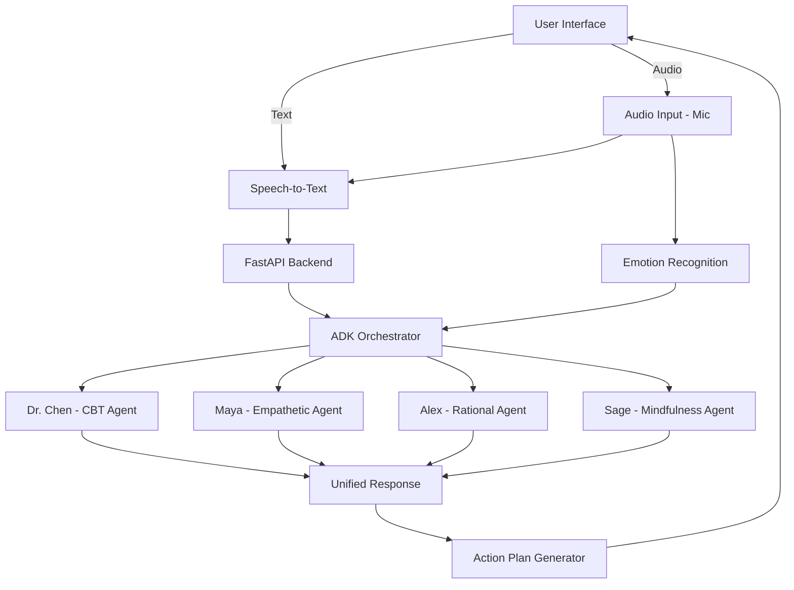

# PersonaReflect 🎭
## AI-Powered Multi-Agent Self-Reflection Coach

### HackDuke 2025 Project

PersonaReflect uses Google ADK to create a multi-agent system that provides diverse perspectives on personal dilemmas through four distinct AI personas.

## 🏗️ Architecture



## 🌟 Features

- **4 Specialized AI Coaches**: Each with unique perspectives and approaches
  - 🧠 **Dr. Chen** - Cognitive-Behavioral Coach
  - 💙 **Maya** - Empathetic Friend
  - 📊 **Alex** - Rational Analyst
  - 🧘 **Sage** - Mindfulness Mentor
- **Multi-Agent Orchestration**: Using Google ADK for coordinated responses
- **Action Plan Generation**: Synthesizes insights into concrete steps
- **Beautiful React Frontend**: Clean, intuitive interface
- **Real-time Processing**: Fast, parallel agent processing

## 🚀 Quick Start (Hackathon Demo)

### Prerequisites
- Python 3.11+
- Node.js 18+
- Google API Key (for Gemini)

### Setup & Install

```bash
# Clone the repo
git clone https://github.com/yuancx2019/hackDuke2025
cd hackDuke2025

# Install backend + frontend dependencies
make install

# Copy env template and add your Google API key
cp backend/.env.example backend/.env
# edit backend/.env and set GOOGLE_API_KEY=<your-key>
```

### Interactive Agent Demo

```bash
cd backend
python interactive_demo.py
```

### Run the Full Stack

```bash
# Backend only (FastAPI + hot reload)
make backend

# Frontend only (Vite dev server)
make frontend

# Both frontend & backend (parallel)
make dev

# Docker (full stack)
make docker-up
```

### Full-Stack Integration Test

**Two-terminal setup:**

```bash
# Terminal 1: Backend
cd backend
uvicorn persona_reflect.main:app --reload --host 0.0.0.0 --port 8000

# Terminal 2: Frontend  
cd frontend
npm install
npm run dev
```

Then open http://localhost:5173/ and test the complete flow:
1. Check for "Connected to AI backend!" toast notification
2. Click "Start New Reflection"
3. Enter a dilemma and submit
4. Verify all 4 AI personas respond (10-20 seconds)
5. Create and save an action plan

**📘 For detailed integration testing:** See [INTEGRATION_TEST.md](./INTEGRATION_TEST.md)

### Access the Application

- 🌐 **Frontend**: http://localhost:5173
- 🔧 **API Docs**: http://localhost:8000/docs
- 📊 **API Health**: http://localhost:8000/

## 📚 API Endpoints

| Endpoint | Method | Description |
|----------|--------|-------------|
| `/` | GET | Health check |
| `/api/reflect` | POST | Process dilemma through all personas |
| `/api/action-plan` | POST | Generate action plan from insights |
| `/api/personas` | GET | Get persona information |

### Example Request

```bash
curl -X POST http://localhost:8000/api/reflect \
  -H "Content-Type: application/json" \
  -d '{
    "user_id": "demo_user",
    "dilemma": "I keep procrastinating on my important project"
  }'
```

## 🛠️ Tech Stack

### Backend
- **Google ADK**: Multi-agent orchestration
- **FastAPI**: REST API framework
- **Google Gemini**: LLM for agents
- **Pydantic**: Data validation

### Frontend
- **React 18**: UI framework
- **TypeScript**: Type safety
- **Tailwind CSS**: Styling
- **Vite**: Build tool
- **Motion**: Animations

## 📦 Project Structure

```
hackDuke2025/
├── backend/                    # ADK multi-agent system
│   ├── persona_reflect/       
│   │   ├── agents/            # Four persona agents
│   │   ├── prompts/           # Few-shot prompts
│   │   └── main.py            # FastAPI server
│   └── requirements.txt
├── frontend/                   # React application
│   └── AI Self-Reflection Coach/
├── docker-compose.yml         # Full-stack deployment
└── Makefile                   # Quick commands
```

## 🧪 Testing the System

1. **Smoke test + dependency checks**

    ```bash
    cd backend
    python quick_test.py
    ```

    > The script verifies `.env`, required packages, module imports, and optionally runs a live ADK agent call.

2. **Interactive multi-agent demo**

    ```bash
    python interactive_demo.py
    ```

    > Choose a sample dilemma or type your own to see all four personas respond in parallel.

3. **API health check (after `make backend` or `make docker-up`)**

    ```bash
    curl -X POST http://localhost:8000/api/reflect \
      -H "Content-Type: application/json" \
      -d '{
        "user_id": "demo_user",
        "dilemma": "I struggle with work-life balance"
      }'
    ```

## 🎮 Demo Flow

1. **Start**: User enters a personal dilemma
2. **Process**: ADK orchestrator distributes to 4 agents in parallel
3. **Insights**: Each persona provides unique perspective
4. **Synthesis**: System generates actionable steps
5. **Track**: User can save and track progress

## 🔧 Development

### Install Dependencies
```bash
make install
```

### Run Tests
```bash
make test-backend
```

### Clean Build
```bash
make clean
```

## 📈 Performance

- **Response Time**: <3 seconds for all 4 personas
- **Parallel Processing**: All agents run concurrently
- **Scalable**: Ready for cloud deployment

## 🚢 Deployment

### Docker Deployment
```bash
make docker-build
make docker-up
```

### Google Cloud Run
```bash
gcloud run deploy persona-reflect \
  --source . \
  --region us-central1 \
  --allow-unauthenticated
```

## 👥 Team

- **Frontend**: React + TypeScript expert
- **Backend**: Google ADK integration
- **AI/ML**: Prompt engineering & agent design
- **DevOps**: Docker & cloud deployment

## 📝 Key Features for Judges

1. **Real Google ADK Implementation**: Not just API calls, but true multi-agent orchestration
2. **Production-Ready**: Docker, tests, proper error handling
3. **Unique Personas**: Each agent has distinct personality via few-shot prompting
4. **Actionable Output**: Synthesizes insights into concrete steps
5. **Clean Architecture**: Modular, scalable, maintainable

## 🔮 Future Enhancements

- [ ] Memory system for conversation history
- [ ] Calendar integration for time management
- [ ] Voice input/output
- [ ] Mobile app
- [ ] More specialized agents (Financial Advisor, Career Coach)
- [ ] A2A protocol for external agent integration

## 📄 License

MIT License - HackDuke 2025

## 🙏 Acknowledgments

- Google ADK team for the amazing framework
- HackDuke organizers
- Coffee ☕

---

*"Your personal board of advisors, powered by AI"*
