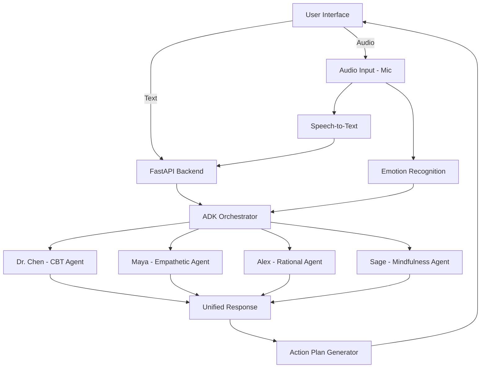

# PersonaReflect 🎭
## AI-Powered Multi-Agent Self-Reflection Coach

### HackDuke 2025 Project

PersonaReflect uses Google ADK to create a multi-agent system that provides diverse perspectives on personal dilemmas through four distinct AI personas.

## 📑 Quick Navigation

- [🌟 Features](#-features) - Overview of capabilities
- [🚀 Quick Start](#-quick-start-hackathon-demo) - Setup & installation
- [🧰 Agent Tools](#-specialized-tools-15-functions) - Tool summary (detailed docs in `agents/README.md`)
- [📊 Google Calendar Integration](#-google-calendar-integration-rational-analyst--alex) - OAuth setup guide
- [🔄 Complete Pipeline](#-complete-pipeline) - Architecture deep-dive

## 🏗️ Architecture



## 🌟 Features

- **4 Specialized AI Coaches**: Each with unique perspectives and approaches
  - 🧠 **Dr. Chen** - Cognitive-Behavioral Coach
  - 💙 **Maya** - Empathetic Friend
  - 📊 **Alex** - Rational Analyst
  - 🧘 **Sage** - Mindfulness Mentor
- **15+ Specialized Tools**: Each agent equipped with evidence-based therapeutic tools
- **Multi-Agent Orchestration**: Using Google ADK for coordinated responses
- **Action Plan Generation**: Synthesizes insights into concrete steps
- **Google Calendar Integration**: Real scheduling and time management
- **Beautiful React Frontend**: Clean, intuitive interface
- **Real-time Processing**: Fast, parallel agent processing

## 🚀 Quick Start (Hackathon Demo)

### Prerequisites
- Python 3.11+
- Node.js 18+
- Google API Key (for Gemini)

### Setup & Install

```bash
# Clone the repo
git clone https://github.com/yuancx2019/hackDuke2025
cd hackDuke2025

# Install backend + frontend dependencies
make install

# Copy env template and add your Google API key
cp backend/.env.example backend/.env
# edit backend/.env and set GOOGLE_API_KEY=<your-key>
```

### Interactive Agent Demo

```bash
cd backend
python interactive_demo.py
```

### Run the Full Stack

```bash

# Pull a prebuilt backend Docker image (this container listens on port 9000)
docker pull eddiehza/fastapi-app:v3.0

# Run the prebuilt backend image and publish it to localhost:9000
docker run -d -p 9000:9000 eddiehza/fastapi-app:v3.0

# Backend only: starts FastAPI with hot-reload (uvicorn, default port 8000)
make backend

# Frontend only: starts the Vite dev server (default port 5173)
make frontend
```

### Full-Stack Integration Test

**Two-terminal setup:**

```bash
# Terminal 1: Backend
cd backend
uvicorn persona_reflect.main:app --reload --host 0.0.0.0 --port 8000

# Terminal 2: Frontend  
cd frontend
npm install
npm run dev
```

Then open http://localhost:5173/ and test the complete flow:
1. Check for "Connected to AI backend!" toast notification
2. Click "Start New Reflection"
3. Enter a dilemma and submit
4. Verify all 4 AI personas respond (10-20 seconds)
5. Create and save an action plan
---

## 📊 Google Calendar Integration (Rational Analyst — Alex)

Our agents can now analyze your workload and directly schedule focused work sessions in **Google Calendar**.
Follow these steps to enable the connection locally.

### ✅ 1️⃣ Create Google Cloud OAuth Credentials

1. Go to the **[Google Cloud Console](https://console.cloud.google.com/)**.
2. Create a new project or use an existing one.
3. Navigate to:

   ```
   APIs & Services → Enabled APIs & Services
   ```
4. Click **“+ ENABLE APIS AND SERVICES.”**
5. Search for **Google Calendar API** → click **Enable**.
6. Then go to:

   ```
   APIs & Services → Credentials → Create Credentials → OAuth client ID
   ```
7. Choose **“Desktop app”** as the application type.
8. Download the generated JSON file (it will look like `client_secret_xxx.json`).

   * This file is your **OAuth client credentials**.
   * **Do not commit or share** this file publicly.

---

### ✅ 2️⃣ Add the Credentials to the Backend

1. Move your downloaded credentials into the backend directory and rename it to:

   ```
   backend/credentials.json
   ```

2. Add both credentials and tokens to your `.gitignore`:

   ```
   backend/credentials.json
   backend/.gcal_token.json
   ```

---

### ✅ 3️⃣ Add Test Users to the OAuth Consent Screen

Since the app is still in testing mode, only test users can authorize it.

1. Go to:

   ```
   APIs & Services → OAuth consent screen → Audience
   ```
2. Under **Test users**, click **“+ ADD USERS.”**
3. Add your Gmail address (e.g. `youremail@gmail.com`).
4. Save changes.

> Only users listed here can log in during OAuth testing.

---

### ✅ 4️⃣ Authorize the App (First-Time Login)

When you run the backend (or call a calendar endpoint for the first time):

1. A browser window will open automatically.
2. Log in with your Google account.
3. Approve access to your **Google Calendar**.
4. A token file will be created automatically:

   ```
   backend/.gcal_token.json
   ```

   * This stores your personal access & refresh tokens.
   * It allows future access without re-login.

> ⚠️ This token file is user-specific. Keep it local and private.

---

### ✅ 5️⃣ Verify Connection

Once authorization is complete, your terminal will show:

```bash
🚀 Initializing PersonaReflect multi-agent system...
✅ Google Calendar token found at backend/.gcal_token.json
```

This confirms your backend is connected to Google Calendar.


## 🛠️ Tech Stack

### Backend
- **Google ADK**: Multi-agent orchestration
- **FastAPI**: REST API framework
- **Google Gemini**: LLM for agents
- **Pydantic**: Data validation

### Frontend
- **React 18**: UI framework
- **TypeScript**: Type safety
- **Tailwind CSS**: Styling
- **Vite**: Build tool
- **Motion**: Animations

## 📦 Project Structure

```
hackDuke2025/
├── backend/                            # Main ADK multi-agent system
│   ├── persona_reflect/               
│   │   ├── agents/                    # AI Persona Agents
│   │   │   ├── README.md              # 📖 Complete agent & tool documentation
│   │   │   ├── orchestrator.py       # Main ADK orchestrator
│   │   │   ├── cognitive_behavioral.py # Dr. Chen (CBT Coach)
│   │   │   ├── empathetic_friend.py   # Maya (Empathetic Friend)
│   │   │   ├── rational_analyst.py    # Alex (Rational Analyst)
│   │   │   ├── mindfulness_mentor.py  # Sage (Mindfulness Mentor)
│   │   │   └── controllers/
│   │   │       └── scheduler.py       # Calendar integration logic
│   │   ├── prompts/                   # Few-shot prompt templates
│   │   │   └── personas.py            # Persona definitions & examples
│   │   ├── tools/                     # Agent tools (15+ functions)
│   │   │   ├── __init__.py            # Tool exports & persona mapping
│   │   │   ├── calendar_tools.py      # Google Calendar integration (3 tools)
│   │   │   ├── cbt_tools.py           # CBT-specific tools (3 tools)
│   │   │   ├── mindfulness_tools.py   # Mindfulness exercises (4 tools)
│   │   │   └── support_tools.py       # General support tools (4 tools)
│   │   ├── services/                  # External service integrations
│   │   │   └── gcal_demo.py           # Google Calendar API wrapper
│   │   └── main.py                    # FastAPI server & endpoints
│   ├── requirements.txt               # Python dependencies
│   ├── Dockerfile                     # Backend container config
│   ├── interactive_demo.py            # CLI demo for testing agents
│   └── quick_test.py                  # Smoke tests
│
├── frontend/                           # React + TypeScript UI
│   ├── src/
│   │   ├── components/                # React components
│   │   │   ├── JournalInput.tsx       # User input interface
│   │   │   ├── PersonaCard.tsx        # Persona response display
│   │   │   ├── ActionPlanCreator.tsx  # Action plan interface
│   │   │   ├── AlexScheduler.tsx      # Calendar booking UI
│   │   │   ├── Dashboard.tsx          # Main dashboard
│   │   │   ├── EmotionChart.tsx       # Emotion visualization
│   │   │   └── ui/                    # Reusable UI components
│   │   ├── services/
│   │   │   ├── api.ts                 # API client
│   │   │   └── frontend-api-service.ts # Service layer
│   │   ├── types/
│   │   │   └── index.ts               # TypeScript type definitions
│   │   └── App.tsx                    # Main app component
│   ├── package.json                   # Node dependencies
│   ├── Dockerfile                     # Frontend container config
│   └── vite.config.ts                 # Vite build configuration
│
├── fastapi/                            # Alternative FastAPI setup
│   ├── app.py                         # Standalone API server
│   ├── requirements.txt
│   └── Dockerfile
│
├── models/                             # ML models (future)
│   └── speechemo/                     # Speech emotion recognition
│       ├── anger.wav                  # Sample audio
│       ├── test.py                    # Model test script
│       └── requirements.txt
│
├── docker-compose.yml                 # Full-stack orchestration
├── Makefile                           # Development commands
└── README.md                          # This file
```

## 🧪 Testing the System

1. **Smoke test + dependency checks**

    ```bash
    cd backend
    python quick_test.py
    ```

    > The script verifies `.env`, required packages, module imports, and optionally runs a live ADK agent call.

2. **Interactive multi-agent demo**

    ```bash
    python interactive_demo.py
    ```

    > Choose a sample dilemma or type your own to see all four personas respond in parallel.

3. **API health check (after `make backend` or `make docker-up`)**

    ```bash
    curl -X POST http://localhost:8000/api/reflect \
      -H "Content-Type: application/json" \
      -d '{
        "user_id": "demo_user",
        "dilemma": "I struggle with work-life balance"
      }'
    ```

## 🔄 Complete Pipeline

### 1. **User Input Layer**
```
Frontend (React) → API Request → FastAPI Backend
```
- User enters dilemma via `JournalInput.tsx`
- Frontend sends POST to `/api/reflect`
- Request includes `user_id`, `dilemma`, and optional `context`

### 2. **Backend Processing Layer**
```
FastAPI → ADK Orchestrator → Multi-Agent System
```
**Entry Point:** `backend/persona_reflect/main.py`
- Receives HTTP request
- Validates input with Pydantic models
- Initializes `PersonaReflectOrchestrator`

**Orchestrator:** `backend/persona_reflect/agents/orchestrator.py`
- Uses Google ADK's multi-agent framework
- Distributes dilemma to all 4 personas in parallel
- Coordinates agent responses via ADK's routing

### 3. **Agent Processing Layer**
```
Orchestrator → [Dr. Chen | Maya | Alex | Sage] → Tools
```

**Four Specialized Agents:**

1. **Dr. Chen (CBT Coach)** - `cognitive_behavioral.py`
   - Applies cognitive-behavioral therapy techniques
   - Uses `cbt_tools.py` for structured exercises

2. **Maya (Empathetic Friend)** - `empathetic_friend.py`
   - Uses `support_tools.py` for empathy techniques

3. **Alex (Rational Analyst)** - `rational_analyst.py`
   - Provides logical, data-driven analysis
   - Uses `calendar_tools.py` for scheduling
   - **Google Calendar Integration** via `services/gcal_demo.py`

4. **Sage (Mindfulness Mentor)** - `mindfulness_mentor.py`
   - Guides mindfulness and meditation practices
   - Uses `mindfulness_tools.py` for exercises

### 🧰 Specialized Tools (15+ Functions)

Each agent has access to **evidence-based therapeutic tools** that go beyond conversation:

| Persona | Tools | Capabilities |
|---------|-------|--------------|
| 🧠 **Dr. Chen** | 3 CBT tools | Detect cognitive distortions, create thought records, behavioral activation |
| 💙 **Maya** | 4 support tools | Reframe self-talk, grounding exercises, mental health resources |
| 📊 **Alex** | 3 calendar tools | **Real Google Calendar integration** - find slots, book events |
| 🧘 **Sage** | 4 mindfulness tools | Breathwork, body scans, values clarification, 5-4-3-2-1 grounding |

**📖 Detailed Documentation:** See [`backend/persona_reflect/agents/README.md`](./backend/persona_reflect/agents/README.md) for:
- Complete tool reference with examples
- Evidence-based techniques (CBT, ACT, MBSR, self-compassion research)
- Implementation details and usage patterns
- How to add new tools

### 4. **Response Synthesis Layer**
```
Agent Responses → Orchestrator → Unified Response
```
- Orchestrator collects all persona responses
- Each response includes:
  - `persona`: Agent identifier
  - `name`: Display name
  - `icon`: UI icon
  - `response`: Actual advice text
- Returns combined insights to FastAPI endpoint

### 5. **Action Plan Generation**
```
POST /api/action-plan → Action Plan Generator → Concrete Steps
```
- User can request actionable steps
- System synthesizes insights from all personas
- Generates prioritized, measurable action items
- Frontend displays via `ActionPlanCreator.tsx`

### 6. **Calendar Integration Flow** (Alex-specific)
```
User Request → Alex Agent → Google Calendar API → Booked Event
```

**Scheduling Flow:**
1. User asks Alex for help with time management
2. Alex agent uses `alex_suggest_with_slots()` from `controllers/scheduler.py`
3. Calls `gcal_demo.py` to fetch real calendar data
4. Suggests optimal time slots based on availability
5. Frontend displays slots via `AlexScheduler.tsx`
6. User selects slot → POST to `/api/alex/book`
7. Event created in real Google Calendar

**OAuth Flow:**
- First run: `gcal_demo.py` initiates OAuth
- Opens browser for Google sign-in
- Stores refresh token in `.gcal_token.json`
- Subsequent calls use cached token

### Development Workflow

1. **Setup Environment**
   ```bash
   # Clone and install
   git clone https://github.com/yuancx2019/hackDuke2025
   cd hackDuke2025
   make install
   
   # Configure API keys
   cp backend/.env.example backend/.env
   # Edit backend/.env with your GOOGLE_API_KEY
   ```

2. **Start Development Servers**
   ```bash
   # Terminal 1: Backend
   make backend
   
   # Terminal 2: Frontend
   make frontend
   ```

3. **Test Changes**
   ```bash
   # Quick smoke test
   cd backend && python quick_test.py
   
   # Interactive agent testing
   cd backend && python interactive_demo.py
   
   # Full test suite
   make test
   ```

4. **Code Quality**
   ```bash
   # Format and lint
   make lint
   
   # Check for errors
   make test
   ```

## 📈 Performance

- **Response Time**: <3 seconds for all 4 personas
- **Parallel Processing**: All agents run concurrently
- **Scalable**: Ready for cloud deployment

## 🚢 Deployment

### Docker Deployment
```bash
make docker-build
make docker-up
```

### Google Cloud Run
```bash
gcloud run deploy persona-reflect \
  --source . \
  --region us-central1 \
  --allow-unauthenticated
```

## 👥 Team
- **Frontend**: React + TypeScript expert
- **Backend**: Google ADK integration
- **AI/ML**: Prompt engineering & agent design
- **DevOps**: Docker & cloud deployment

## 📝 Key Features for Judges

1. **Real Google ADK Implementation**: Not just API calls, but true multi-agent orchestration
2. **15+ Evidence-Based Tools**: CBT, mindfulness, self-compassion, and real calendar integration
3. **Production-Ready**: Docker, tests, proper error handling
4. **Unique Personas**: Each agent has distinct personality via few-shot prompting
5. **Real Google Calendar Integration**: Actual OAuth flow, live scheduling capabilities
6. **Therapeutic Foundations**: Tools based on CBT, ACT, MBSR, and self-compassion research
7. **Actionable Output**: Synthesizes insights into concrete steps
8. **Clean Architecture**: Modular, scalable, maintainable

## 🔮 Future Enhancements

- [ ] Memory system for conversation history
- [ ] More specialized agents (Financial Advisor, Career Coach)
- [ ] A2A protocol for external agent integration

## 📄 License

MIT License - HackDuke 2025

---

*"Your personal board of advisors, powered by AI"*
